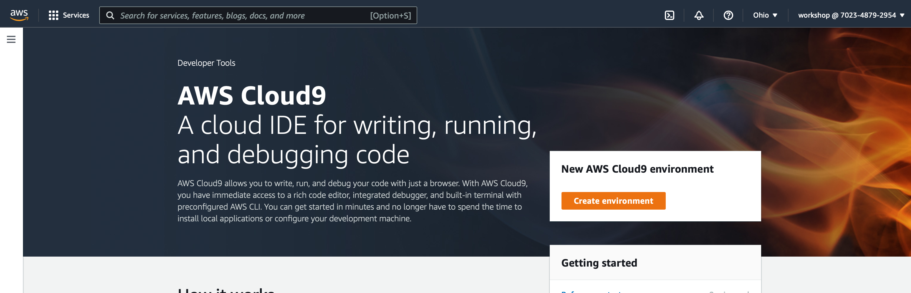

# Setup the environment 

These instructors walk through all the steps necessary to set up a lab environment.

- Log into the AWS Console
- Create a Cloud9 environment 
- Install all the required tools (kubectl, jq, yq, etc.)
- Configure an IAM role and policies for the Cloud9 environment
- Clone the application GitHub repositories


### Log into the AWS Console

The instructor will provide credentials to log into the AWS Console.    

After logging in, confirm you have selected the **Ohio (us-east-2)** region in the top right.



### Launch Cloud9 in the Ohio (us-east-2) region:

Create a Cloud9 Environment: [https://us-east-2.console.aws.amazon.com/cloud9/home?region=us-east-2](https://us-east-2.console.aws.amazon.com/cloud9/home?region=us-east-2?name=eksworkshop&instanceType=t3.small)

- Select **Create environment**
- Name it **eksworkshop**, click Next.
- Choose **t3.small** for instance type, take all default values, and click **Create environment**

When it comes up, customize the environment by:

- Closing the **Welcome tab**[](https://www.eksworkshop.com/images/prerequisites/cloud9-1.png)

  

- Opening a new **terminal** tab in the main work area[](https://www.eksworkshop.com/images/prerequisites/cloud9-2.png)

  

- Closing the lower work area[](https://www.eksworkshop.com/images/prerequisites/cloud9-3.png)

  

- Your workspace should now look like this[](https://www.eksworkshop.com/images/prerequisites/cloud9-4.png)

Increase the storage on the Cloud9 instance so there's ample space for all the repositories.

### Increase the disk size on the Cloud9 instance

The following command adds more disk space to the root volume of the EC2 instance that Cloud9 runs on. Once the command completes, we reboot the instance and it could take a minute or two for the IDE to come back online.

```bash
pip3 install --user --upgrade boto3
export instance_id=$(curl -s http://169.254.169.254/latest/meta-data/instance-id)
python -c "import boto3
import os
from botocore.exceptions import ClientError 
ec2 = boto3.client('ec2')
volume_info = ec2.describe_volumes(
    Filters=[
        {
            'Name': 'attachment.instance-id',
            'Values': [
                os.getenv('instance_id')
            ]
        }
    ]
)
volume_id = volume_info['Volumes'][0]['VolumeId']
try:
    resize = ec2.modify_volume(    
            VolumeId=volume_id,    
            Size=30
    )
    print(resize)
except ClientError as e:
    if e.response['Error']['Code'] == 'InvalidParameterValue':
        print('ERROR MESSAGE: {}'.format(e))"
if [ $? -eq 0 ]; then
    sudo reboot
fi
```


### Install Tools

#### Install kubectl

```bash
curl -LO "https://dl.k8s.io/release/$(curl -L -s https://dl.k8s.io/release/stable.txt)/bin/linux/amd64/kubectl"
chmod +x kubectl
sudo mv kubectl /usr/local/bin/kubectl
```

#### Update awscli

Upgrade AWS CLI tools.

```bash
curl "https://awscli.amazonaws.com/awscli-exe-linux-x86_64.zip" -o "awscliv2.zip"
unzip awscliv2.zip
sudo ./aws/install
```

#### Install jq, envsubst (from GNU gettext utilities) and bash-completion

```bash
sudo yum -y install jq gettext bash-completion moreutils
```

#### Install yq for yaml processing

```bash
echo 'yq() {
  docker run --rm -i -v "${PWD}":/workdir mikefarah/yq "$@"
}' | tee -a ~/.bashrc && source ~/.bashrc
```

#### Verify the binaries are in the path and executable

```bash
for command in kubectl jq envsubst aws
  do
    which $command &>/dev/null && echo "$command in path" || echo "$command NOT FOUND"
  done
```

#### Enable kubectl bash_completion

```bash
kubectl completion bash >>  ~/.bash_completion
. /etc/profile.d/bash_completion.sh
. ~/.bash_completion
```

#### set the AWS Load Balancer Controller version

```bash
echo 'export LBC_VERSION="v2.4.1"' >>  ~/.bash_profile
echo 'export LBC_CHART_VERSION="1.4.1"' >>  ~/.bash_profile
.  ~/.bash_profile
```


### CREATE AN IAM ROLE FOR YOUR WORKSPACE

1. Follow [this link to create an IAM role with Administrator access](https://console.aws.amazon.com/iam/home#/roles$new?step=review&commonUseCase=EC2%2BEC2&selectedUseCase=EC2&policies=arn:aws:iam::aws:policy%2FAdministratorAccess&roleName=eksworkshop-admin).
2. Confirm that **AWS service** and **EC2** are selected, then click **Next: Permissions** to view permissions.
3. Confirm that **AdministratorAccess** is checked, then click **Next: Tags** to assign tags.
4. Take the defaults, and click **Next: Review** to review.
5. Enter **eksworkshop-admin** for the Name, and click **Create role**.[](https://www.eksworkshop.com/images/prerequisites/createrole.png)


### ATTACH THE IAM ROLE TO YOUR WORKSPACE

Now that the **Admin** role has been created, attach it to your Cloud9 workspace instance.

1. Click the grey circle button (in top right corner) and select **Manage EC2 Instance**.[](https://www.eksworkshop.com/images/prerequisites/cloud9-role.png)
2. Select the instance, then choose **Actions / Security / Modify IAM Role**[](https://www.eksworkshop.com/images/prerequisites/c9instancerole.png)
3. Choose **eksworkshop-admin** from the **IAM Role** drop down, and select **Save**[](https://www.eksworkshop.com/images/prerequisites/c9attachrole.png)


### UPDATE IAM SETTINGS FOR YOUR WORKSPACE

Configure the Cloud9 workspace to use the IAM role for EKS authentication.

To ensure temporary credentials aren’t already in place we will remove any existing credentials file as well as disabling **AWS managed temporary credentials**:

```sh
aws cloud9 update-environment  --environment-id $C9_PID --managed-credentials-action DISABLE
rm -vf ${HOME}/.aws/credentials
```

We should configure our aws cli with our current region as default.

```sh
export ACCOUNT_ID=$(aws sts get-caller-identity --output text --query Account)
export AWS_REGION=$(curl -s 169.254.169.254/latest/dynamic/instance-identity/document | jq -r '.region')
export AZS=($(aws ec2 describe-availability-zones --query 'AvailabilityZones[].ZoneName' --output text --region $AWS_REGION))
```

Check if AWS_REGION is set to desired region

```sh
test -n "$AWS_REGION" && echo AWS_REGION is "$AWS_REGION" || echo AWS_REGION is not set
```

You should see `us-east-2`

Let’s save these into `bash_profile`

```sh
echo "export ACCOUNT_ID=${ACCOUNT_ID}" | tee -a ~/.bash_profile
echo "export AWS_REGION=${AWS_REGION}" | tee -a ~/.bash_profile
echo "export AZS=(${AZS[@]})" | tee -a ~/.bash_profile
aws configure set default.region ${AWS_REGION}
aws configure get default.region
```


### Validate the IAM role

Use the [GetCallerIdentity](https://docs.aws.amazon.com/cli/latest/reference/sts/get-caller-identity.html) CLI command to validate that the Cloud9 IDE is using the correct IAM role.

```bash
aws sts get-caller-identity --query Arn | grep eksworkshop-admin -q && echo "IAM role valid" || echo "IAM role NOT valid"
```

If the IAM role is not valid, **DO NOT PROCEED**. Go back and confirm the steps on this page.

If you are still having issues after confirming the steps have been followed please let your instructor know.


### CLONE THE SERVICE REPOS

Now that the Cloud9 environment is configured correctly, clone the application files.

```sh
cd ~/environment
git clone https://github.com/aws-containers/ecsdemo-frontend.git
git clone https://github.com/aws-containers/ecsdemo-nodejs.git
git clone https://github.com/aws-containers/ecsdemo-crystal.git
```


### CREATE AN AWS KMS CUSTOM MANAGED KEY (CMK)

Create a CMK for the EKS cluster to use when encrypting your Kubernetes secrets:

```bash
aws kms create-alias --alias-name alias/eksworkshop --target-key-id $(aws kms create-key --query KeyMetadata.Arn --output text)
```

Let’s retrieve the ARN of the CMK to input into the create cluster command.

```bash
export MASTER_ARN=$(aws kms describe-key --key-id alias/eksworkshop --query KeyMetadata.Arn --output text)
```

We set the `MASTER_ARN` environment variable to make it easier to refer to the KMS key later.

Now, let’s save the `MASTER_ARN` environment variable into the bash_profile

```bash
echo "export MASTER_ARN=${MASTER_ARN}" | tee -a ~/.bash_profile
```


### Congrats!

Now you have a working Cloud9 lab environment. 
