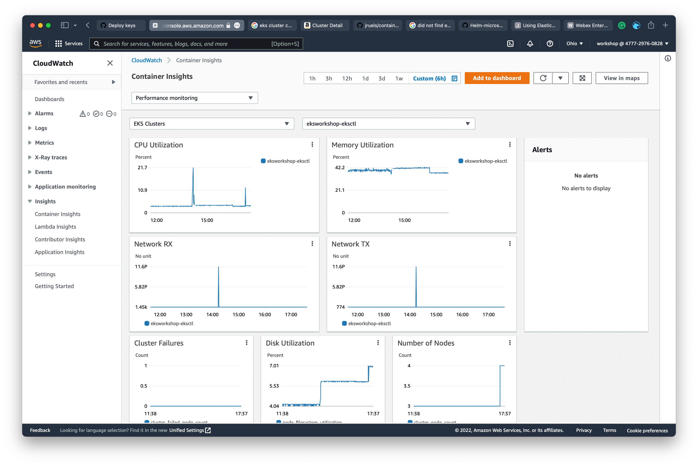
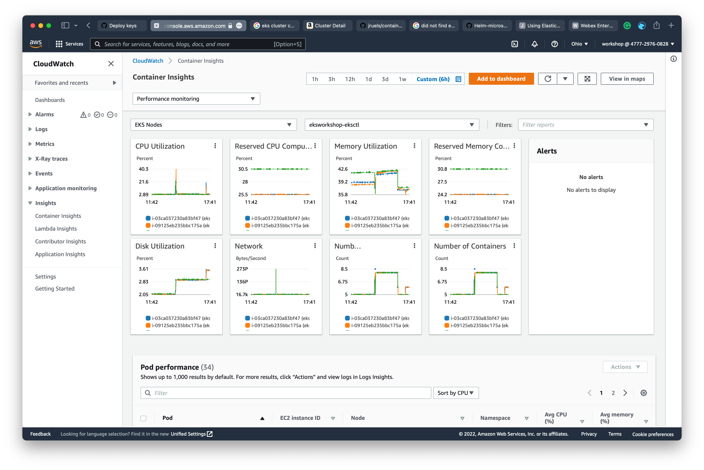

# OBSERVABILITY SETUP

### CONSOLE CREDENTIALS

The EKS console allows you to see not only the configuration aspects of your cluster, but also to view Kubernetes cluster objects such as Deployments, Pods, and Nodes. For this type of access, the console IAM User or Role needs to be granted permission within the cluster.

By default, the credentials used to create the cluster are automatically granted these permissions. Following along in the workshop, you’ve created a cluster using temporary IAM credentials from within Cloud9. This means that you’ll need to add your AWS Console credentials to the cluster.

#### Import your EKS Console credentials to your new cluster:

IAM Users and Roles are bound to an EKS Kubernetes cluster via a ConfigMap named `aws-auth`. We can use `eksctl` to do this with one command.

You’ll need to determine the correct credential to add for your AWS Console access. Invoke the following within your environment to determine your IAM Role or User ARN.

```bash
c9builder=$(aws cloud9 describe-environment-memberships --environment-id=$C9_PID | jq -r '.memberships[].userArn')
if echo ${c9builder} | grep -q user; then
	rolearn=${c9builder}
        echo Role ARN: ${rolearn}
elif echo ${c9builder} | grep -q assumed-role; then
        assumedrolename=$(echo ${c9builder} | awk -F/ '{print $(NF-1)}')
        rolearn=$(aws iam get-role --role-name ${assumedrolename} --query Role.Arn --output text) 
        echo Role ARN: ${rolearn}
fi
```

With your ARN in hand, you can issue the command to create the identity mapping within the cluster.

```bash
eksctl create iamidentitymapping --cluster eksworkshop-eksctl --arn ${rolearn} --group system:masters --username admin
```

Note that permissions can be restricted and granular but as this is a workshop cluster, you’re adding your console credentials as administrator.

Now you can verify your entry in the AWS auth map within the console.

```bash
kubectl describe configmap -n kube-system aws-auth
```

Now you’re all set to move on.

### EKS FARGATE AND OBSERVABILITY SETUP

In this lab, we will perform the following tasks in your existing EKS cluster `eksworkshop-eksctl`.

- Create Fargate Profile
- Enable OIDC Provider
- Create Namespace for Application Deployment
- Create IRSA (IAM Role for Service Account) for Application Namespace `prodcatalog-ns`
- Enable Observability for Logs and Metrics


Check if AWS_REGION and ACCOUNT_ID are set correctly

```sh
test -n "$AWS_REGION" && echo AWS_REGION is "$AWS_REGION" || echo AWS_REGION is not set
test -n "$ACCOUNT_ID" && echo ACCOUNT_ID is "$ACCOUNT_ID" || echo ACCOUNT_ID is not set
```

If not, export the ACCOUNT_ID and AWS_REGION to ENV

```
export ACCOUNT_ID=<your_account_id>
export AWS_REGION=<your_aws_region>
    
```


- Clone the repository to your local workspace with this command:

```
cd ~/environment
git clone https://github.com/aws-containers/eks-app-mesh-polyglot-demo.git
cd eks-app-mesh-polyglot-demo
```

Now lets, create the Fargate Profile in our EKS cluster to deploy one `prodcatalog` service in our Product Catalog Application.

### ADD FARGATE PROFILE

#### Create IAM OIDC provider

First, we will have to set up an OIDC provider with the cluster. The IAM OIDC Provider is not enabled by default, you can use the following command to enable it.

```bash
eksctl utils associate-iam-oidc-provider \
    --region ${AWS_REGION} \
    --cluster eksworkshop-eksctl \
    --approve
```

#### Create the Namespace and IAM Role and ServiceAccount

We will create the `prodcatalog-ns` and the IRSA for this namespace which will give permission to X-Ray, AppMesh and Cloudwatch Logs policies.

```bash
kubectl create namespace prodcatalog-ns

aws iam create-policy \
    --policy-name ProdEnvoyNamespaceIAMPolicy \
    --policy-document file://deployment/envoy-iam-policy.json

eksctl create iamserviceaccount --cluster eksworkshop-eksctl \
  --namespace prodcatalog-ns \
  --name prodcatalog-envoy-proxies \
  --attach-policy-arn arn:aws:iam::$ACCOUNT_ID:policy/ProdEnvoyNamespaceIAMPolicy \
  --override-existing-serviceaccounts \
  --approve 
```


The IAM role gets associated with a Kubernetes Service Account. You can see details of the service account created with the following command.

```bash
kubectl describe sa prodcatalog-envoy-proxies -n prodcatalog-ns

Name:                prodcatalog-envoy-proxies
Namespace:           prodcatalog-ns
Labels:              app.kubernetes.io/managed-by=eksctl
Annotations:         eks.amazonaws.com/role-arn: arn:aws:iam::$ACCOUNT_ID:role/eksctl-eksworkshop-eksctl-addon-iamserviceac-Role1-1PWNQ4AJFMVBF
Image pull secrets:  <none>
Mountable secrets:   prodcatalog-envoy-proxies-token-69pql
Tokens:              prodcatalog-envoy-proxies-token-69pql
Events:              <none>
```


#### Create a Fargate profile

The [Fargate profile](https://docs.aws.amazon.com/eks/latest/userguide/fargate-profile.html) allows an administrator to declare which pods run on Fargate. Each profile can have up to five selectors that contain a **namespace** and optional **labels**. You must define a namespace for every selector. The label field consists of multiple optional key-value pairs. Pods that match a selector (by matching a namespace for the selector and all of the labels specified in the selector) are scheduled on Fargate.

It is generally a good practice to deploy user application workloads into namespaces other than **kube-system** or **default** so that you have more fine-grained capabilities to manage the interaction between your pods deployed on to EKS. In this chapter we will create a new Fargate profile named **fargate-productcatalog** that targets all pods destined for the `prodcatalog-ns` namespace with label `app: prodcatalog`. You can see the Fargate Profile configuration below.

```
apiVersion: eksctl.io/v1alpha5
kind: ClusterConfig

metadata:
  name: eksworkshop-eksctl
  region: ${AWS_REGION}

....
....
fargateProfiles:
  - name: fargate-productcatalog
    selectors:
      - namespace: prodcatalog-ns
        labels:
          app: prodcatalog
```

Run the below command to create the Fargate Profile

```bash
cd ~/environment/eks-app-mesh-polyglot-demo
envsubst < ./deployment/clusterconfig.yaml | eksctl create fargateprofile -f -
```

When your EKS cluster schedules pods on Fargate, the pods will need to make calls to AWS APIs on your behalf to do things like pull container images from Amazon ECR. The Fargate **Pod Execution Role** provides the IAM permissions to do this. This IAM role is automatically created for you by the above command.

Creation of a Fargate profile can take up to several minutes. Execute the following command after the profile creation is completed and you should see output similar to what is shown below.

The creation of the Fargate Profile will take about 5 - 7 minutes.

```bash
eksctl get fargateprofile --cluster eksworkshop-eksctl -o yaml

- name: fargate-productcatalog
  podExecutionRoleARN: arn:aws:iam::$ACCOUNT_ID:role/eksctl-eksworkshop-eksctl-FargatePodExecutionRole-JPQ56PZ7R9NL
  selectors:
  - labels:
      app: prodcatalog
    namespace: prodcatalog-ns
  status: ACTIVE
  subnets:
  - subnet-084a7XXXXXXXXXXXX
  - subnet-0b2dXXXXXXXXXXXXX
  - subnet-08565XXXXXXXXXXXX
```

Log into console and navigate to Amazon EKS -> Cluster -> Click `eksworkshop-eksctl` -> Compute, you should see the new Fargate Profile `fargate-productcatalog` you created:[](https://www.eksworkshop.com/images/app_mesh_fargate/fargate.png)

Notice that the profile includes the private subnets in your EKS cluster. Pods running on Fargate are not assigned public IP addresses, so only private subnets (with no direct route to an Internet Gateway) are supported when you create a Fargate profile. Hence, while provisioning an EKS cluster, you must make sure that the VPC that you create contains one or more private subnets. When you create an EKS cluster with eksctl utility, under the hoods it creates a VPC that meets these requirements.


### Enable Amazon Cloudwatch Container Insights

Create an IAM role for the cloudwatch-agent service account

```bash
eksctl create iamserviceaccount \
  --cluster eksworkshop-eksctl \
  --namespace amazon-cloudwatch \
  --name cloudwatch-agent \
  --attach-policy-arn  arn:aws:iam::aws:policy/CloudWatchAgentServerPolicy \
  --override-existing-serviceaccounts \
  --approve
```


Sample output:

```
2021-05-02 17:52:36 [ℹ]  using region $AWS_REGION
2021-05-02 17:52:36 [ℹ]  1 existing iamserviceaccount(s) (prodcatalog-ns/prodcatalog-envoy-proxies) will be excluded
2021-05-02 17:52:36 [ℹ]  1 iamserviceaccount (amazon-cloudwatch/cloudwatch-agent) was included (based on the include/exclude rules)
2021-05-02 17:52:36 [!]  metadata of serviceaccounts that exist in Kubernetes will be updated, as --override-existing-serviceaccounts was set
2021-05-02 17:52:36 [ℹ]  1 task: { 2 sequential sub-tasks: { create IAM role for serviceaccount "amazon-cloudwatch/cloudwatch-agent", create serviceaccount "amazon-cloudwatch/cloudwatch-agent" } }
2021-05-02 17:52:36 [ℹ]  building iamserviceaccount stack "eksctl-eksworkshop-eksctl-addon-iamserviceaccount-amazon-cloudwatch-cloudwatch-agent"
2021-05-02 17:52:37 [ℹ]  deploying stack "eksctl-eksworkshop-eksctl-addon-iamserviceaccount-amazon-cloudwatch-cloudwatch-agent"
2021-05-02 17:52:37 [ℹ]  waiting for CloudFormation stack "eksctl-eksworkshop-eksctl-addon-iamserviceaccount-amazon-cloudwatch-cloudwatch-agent"
2021-05-02 17:53:10 [ℹ]  created namespace "amazon-cloudwatch"
2021-05-02 17:53:10 [ℹ]  created serviceaccount "amazon-cloudwatch/cloudwatch-agent"
```


Create an IAM role for the fluent service account

```bash
eksctl create iamserviceaccount \
  --cluster eksworkshop-eksctl \
  --namespace amazon-cloudwatch \
  --name fluentd \
  --attach-policy-arn  arn:aws:iam::aws:policy/CloudWatchAgentServerPolicy \
  --override-existing-serviceaccounts \
  --approve
```


Sample output

```
2021-05-02 17:54:09 [ℹ]  eksctl version 0.45.0
2021-05-02 17:54:09 [ℹ]  using region $AWS_REGION
2021-05-02 17:54:10 [ℹ]  2 existing iamserviceaccount(s) (amazon-cloudwatch/cloudwatch-agent,prodcatalog-ns/prodcatalog-envoy-proxies) will be excluded
2021-05-02 17:54:10 [ℹ]  1 iamserviceaccount (amazon-cloudwatch/fluentd) was included (based on the include/exclude rules)
2021-05-02 17:54:10 [!]  metadata of serviceaccounts that exist in Kubernetes will be updated, as --override-existing-serviceaccounts was set
2021-05-02 17:54:10 [ℹ]  1 task: { 2 sequential sub-tasks: { create IAM role for serviceaccount "amazon-cloudwatch/fluentd", create serviceaccount "amazon-cloudwatch/fluentd" } }
2021-05-02 17:54:10 [ℹ]  building iamserviceaccount stack "eksctl-eksworkshop-eksctl-addon-iamserviceaccount-amazon-cloudwatch-fluentd"
2021-05-02 17:54:10 [ℹ]  deploying stack "eksctl-eksworkshop-eksctl-addon-iamserviceaccount-amazon-cloudwatch-fluentd"
2021-05-02 17:54:10 [ℹ]  waiting for CloudFormation stack "eksctl-eksworkshop-eksctl-addon-iamserviceaccount-amazon-cloudwatch-fluentd"
2021-05-02 17:54:44 [ℹ]  created serviceaccount "amazon-cloudwatch/fluentd"
```


Now, Deploy Container Insights for Managed Nodegroup

```bash
curl -s https://raw.githubusercontent.com/aws-samples/amazon-cloudwatch-container-insights/latest/k8s-deployment-manifest-templates/deployment-mode/daemonset/container-insights-monitoring/quickstart/cwagent-fluentd-quickstart.yaml | sed "s/{{cluster_name}}/eksworkshop-eksctl/;s/{{region_name}}/${AWS_REGION}/" | kubectl apply -f -    
```


```
% Total    % Received % Xferd  Average Speed   Time    Time     Time  Current
                                Dload  Upload   Total   Spent    Left  Speed
100 15552  100 15552    0     0  45840      0 --:--:-- --:--:-- --:--:-- 45876
namespace/amazon-cloudwatch configured
serviceaccount/cloudwatch-agent configured
clusterrole.rbac.authorization.k8s.io/cloudwatch-agent-role created
clusterrolebinding.rbac.authorization.k8s.io/cloudwatch-agent-role-binding created
configmap/cwagentconfig created
daemonset.apps/cloudwatch-agent created
configmap/cluster-info created
serviceaccount/fluentd configured
clusterrole.rbac.authorization.k8s.io/fluentd-role created
clusterrolebinding.rbac.authorization.k8s.io/fluentd-role-binding created
configmap/fluentd-config created
```


The command above will:

- Create the `Namespace` amazon-cloudwatch.
- Create all the necessary security objects for both DaemonSets:
  - `SecurityAccount`.
  - `ClusterRole`.
  - `ClusterRoleBinding`.
- Deploy Cloudwatch-Agent (responsible for sending the **metrics** to CloudWatch) as a `DaemonSet`.
- Deploy fluentd (responsible for sending the **logs** to Cloudwatch) as a `DaemonSet`.
- Deploy `ConfigMap` configurations for both DaemonSets.


You can verify all the `DaemonSets` have been deployed by running the following command.

```bash
kubectl -n amazon-cloudwatch get daemonsets
NAME                 DESIRED   CURRENT   READY   UP-TO-DATE   AVAILABLE   NODE SELECTOR   AGE
cloudwatch-agent     3         3         3       3            3           <none>          2m43s
fluentd-cloudwatch   3         3         3       3            3           <none>          2m43s
```

You can also verify the deployment of `DaemonSets` by logging into console and navigate to Amazon EKS -> Resources -> Workloads,[](https://www.eksworkshop.com/images/app_mesh_fargate/cloudwatchd.png)


#### Enable Prometheus Metrics in CloudWatch

Create an IAM role for the prometheus service account

```bash
eksctl create iamserviceaccount \
  --cluster eksworkshop-eksctl \
  --namespace amazon-cloudwatch \
  --name cwagent-prometheus \
  --attach-policy-arn  arn:aws:iam::aws:policy/CloudWatchAgentServerPolicy \
  --override-existing-serviceaccounts \
  --approve
```

Sample output:

```
2021-05-02 18:00:25 [ℹ]  eksctl version 0.45.0
2021-05-02 18:00:25 [ℹ]  using region $AWS_REGION
2021-05-02 18:00:26 [ℹ]  3 existing iamserviceaccount(s) (amazon-cloudwatch/cloudwatch-agent,amazon-cloudwatch/fluentd,prodcatalog-ns/prodcatalog-envoy-proxies) will be excluded
2021-05-02 18:00:26 [ℹ]  1 iamserviceaccount (amazon-cloudwatch/cwagent-prometheus) was included (based on the include/exclude rules)
2021-05-02 18:00:26 [!]  metadata of serviceaccounts that exist in Kubernetes will be updated, as --override-existing-serviceaccounts was set
2021-05-02 18:00:26 [ℹ]  1 task: { 2 sequential sub-tasks: { create IAM role for serviceaccount "amazon-cloudwatch/cwagent-prometheus", create serviceaccount "amazon-cloudwatch/cwagent-prometheus" } }
2021-05-02 18:00:26 [ℹ]  building iamserviceaccount stack "eksctl-eksworkshop-eksctl-addon-iamserviceaccount-amazon-cloudwatch-cwagent-prometheus"
2021-05-02 18:00:26 [ℹ]  deploying stack "eksctl-eksworkshop-eksctl-addon-iamserviceaccount-amazon-cloudwatch-cwagent-prometheus"
2021-05-02 18:00:26 [ℹ]  waiting for CloudFormation stack "eksctl-eksworkshop-eksctl-addon-iamserviceaccount-amazon-cloudwatch-cwagent-prometheus"
2021-05-02 18:00:59 [ℹ]  created serviceaccount "amazon-cloudwatch/cwagent-prometheus"
```


Install Prometheus Agent

```bash
kubectl apply -f https://raw.githubusercontent.com/aws-samples/amazon-cloudwatch-container-insights/latest/k8s-deployment-manifest-templates/deployment-mode/service/cwagent-prometheus/prometheus-eks.yaml
```


Sample output:

```
namespace/amazon-cloudwatch unchanged
configmap/prometheus-cwagentconfig created
configmap/prometheus-config created
serviceaccount/cwagent-prometheus configured
clusterrole.rbac.authorization.k8s.io/cwagent-prometheus-role created
clusterrolebinding.rbac.authorization.k8s.io/cwagent-prometheus-role-binding created
deployment.apps/cwagent-prometheus created
```


Confirm that the agent is running

```bash
kubectl get pod -l "app=cwagent-prometheus" -n amazon-cloudwatch

NAME                                 READY   STATUS    RESTARTS   AGE
cwagent-prometheus-95896694d-99pwb   1/1     Running   0          2m33s
```


#### Enable Logging for Fargate

Amazon EKS with Fargate supports a built-in log router, which means there are no sidecar containers to install or maintain. Apply a ConfigMap to your Amazon EKS cluster with a Fluent Conf data value that defines where container logs are shipped to. This logging ConfigMap has to be used in a fixed namespace called aws-observability has a cluster-wide effect, meaning that you can send application-level logs from any application in any namespace.

In this workshop, we will show you how to use cloudwatch_logs to send logs from a workload running in an EKS on Fargate cluster to CloudWatch.

First, create the dedicated aws-observability namespace and the ConfigMap for Fluent Bit

```bash
cd ~/environment/eks-app-mesh-polyglot-demo
envsubst < ./deployment/fluentbit-config.yaml | kubectl apply -f -

namespace/aws-observability created
configmap/aws-logging created
```

Next, verify if the Fluent Bit ConfigMap is deployed correctly

```bash
kubectl -n aws-observability get cm

NAME          DATA   AGE
aws-logging   1      18s
```

With Fluent Bit set up we next need to give it the permission to write to CloudWatch. We do that by first downloading the policy locally:

```bash
curl -o permissions.json \
     https://raw.githubusercontent.com/aws-samples/amazon-eks-fluent-logging-examples/mainline/examples/fargate/cloudwatchlogs/permissions.json
```


```
% Total    % Received % Xferd  Average Speed   Time    Time     Time  Current
                                Dload  Upload   Total   Spent    Left  Speed
100   215  100   215    0     0   1023      0 --:--:-- --:--:-- --:--:--  1023
```

And next we create the policy:


```bash
aws iam create-policy \
        --policy-name FluentBitEKSFargate \
        --policy-document file://permissions.json 
```

And then, Attach the Policy to the Pod Execution Role of our EKS on Fargate cluster

```bash
export PodRole=$(aws eks describe-fargate-profile --cluster-name eksworkshop-eksctl --fargate-profile-name fargate-productcatalog --query 'fargateProfile.podExecutionRoleArn' | sed -n 's/^.*role\/\(.*\)".*$/\1/ p')
aws iam attach-role-policy \
        --policy-arn arn:aws:iam::${ACCOUNT_ID}:policy/FluentBitEKSFargate \
        --role-name ${PodRole}
echo $PodRole
```

Log into console and navigate to EKS -> Cluster -> Compute, select `fargate-productcatalog` Fargate Profile, you will see the below page.[](https://www.eksworkshop.com/images/app_mesh_fargate/fargatepodrole.png)

Click on the Pod Execution Role. You should see the below `FluentBitEKSFargate` policy that was attached to the Pod Execution Role.[](https://www.eksworkshop.com/images/app_mesh_fargate/fluentbit.png)


# OBSERVABILITY

In this section, we will dive into key operational data and tools such as CloudWatch Container Insights, Cloudwatch Logs and Prometheus that you can leverage within the AWS environment to supercharge your ability to monitor metrics, collect logs, trigger alerts, and trace distributed services.

Observability includes the use of various signals (metrics, traces, logs) to monitor the overall health of your application. And in this section, we’ll use the following data and tools to get end-to-end visibility into our Product Catalog Application deployed in EKS.

- Container Insights

- Cloudwatch Container logs

- Prometheus App Mesh Metrics

- Fargate Container logs

- AWS X-Ray Tracing

  

#### CONTAINER INSIGHTS

CloudWatch Container Insights is a fully managed service that collects, aggregates, and summarizes Amazon EKS metrics and logs. The CloudWatch Container Insights dashboard gives you access to the following information:

- CPU and memory utilization
- Task and service counts
- Read/write storage
- Network Rx/Tx
- Container instance counts for clusters, services, and tasks

Log in to the console, navigate to Cloudwatch -> Insights -> Container Insights -> and select Performance Monitoring in the drop-down, and you can see the `EKS Cluster` insight.




You can change the dropdown to `EKS Nodes` to see the Nodes insight



### CLOUDWATCH LOGS

#### Cloudwatch Console

Logs are collected by the fluentd daemonset running in the EKS nodes and also by Fluentbit daemonset that collects logs from Fargate and sends them to Cloudwatch.

The following CloudWatch log groups are created by default when Container Insights is setup:

- /aws/containerinsights/cluster-name/application
- /aws/containerinsights/cluster-name/dataplane
- /aws/containerinsights/cluster-name/hostNodegroup Container Logs
- /aws/containerinsights/cluster-name/performance
- /aws/eks/eksworkshop-eksctl/cluster
- fluent-bit-cloudwatch

Log in to the console, and navigate to Cloudwatch -> Logs -> Log groups, you should see the below log groups


#### Nodegroup Container Logs

Click on the `application` Log group, and click on `Search All`


Now, Type `Catalog Detail Version` in the Search box and Click enter, you should see the below logs from the `proddetail` backend service


#### Fargate Container Logs

Log into the console, navigate to Cloudwatch -> Logs -> Log groups, Click on the `fluent-bit-cloudwatch` Log group. Click on `Search All` and type `Get Request succeeded` in the search box and hit enter. You should see the below logs.


