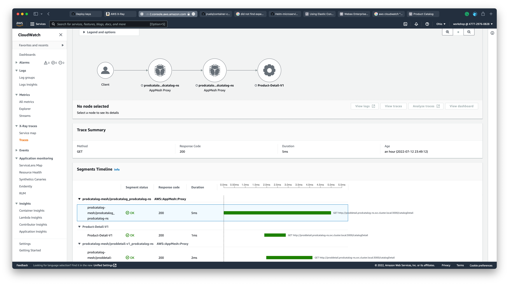

# APPLICATION METRICS

### PROMETHEUS METRICS

CloudWatch Container Insights monitoring for Prometheus automates the discovery of Prometheus metrics from containerized systems and workloads. Prometheus is an open-source monitoring and alerting toolkit.

#### Prometheus Metrics Logs

The CloudWatch agent supports the standard Prometheus scrape configurations as documented in the [scrape_config](https://prometheus.io/docs/prometheus/latest/configuration/configuration/#scrape_config) in the Prometheus documentation. The CloudWatch agent YAML has jobs configured that are scraped, and the metrics are sent to CloudWatch.

Log events from Amazon EKS and Kubernetes clusters are stored in the `/aws/containerinsights/cluster_name/prometheus` Log group in Amazon CloudWatch Logs.

Log into the console, navigate to Cloudwatch -> Logs -> Log groups, and you should see the `/aws/containerinsights/eksworkshop-eksctl/prometheus`Log group. Select this and you should be able to see the metrics for all the containers logged here.


#### Prometheus Metrics

The CloudWatch agent with Prometheus support automatically collects metrics from services and workloads. Prometheus metrics collected from Amazon EKS and Kubernetes clusters are in the `ContainerInsights/Prometheus` namespace.

Log into console, navigate to Cloudwatch -> Metrics -> All Metrics -> ContainerInsights/Prometheus -> “ClusterName, Namespace” , you should see the below metrics for the namespace `prodcatalog-ns`. Select any of the metrics (as in the below example `envoy_cluster_upstream_cx_rx_bytes_total`) to add to the graph. You can find the complete list of Prometheus Metrics for App Mesh [here](https://docs.aws.amazon.com/AmazonCloudWatch/latest/monitoring/ContainerInsights-Prometheus-metrics.html#ContainerInsights-Prometheus-metrics-appmesh).


#### Prometheus Report

In the CloudWatch console, Container Insights provides pre-built reports for App Mesh in Amazon EKS and Kubernetes clusters.

To see the pre-built reports on App Mesh Prometheus metrics, Log into the console, navigate to Cloudwatch -> Container Insights -> Select `Performance monitoring` from the top drop-down menu, select `EKS Prometheus App Mesh` in the lower drop-down and select the `EKS cluster` in second dropdown.


# XRAY TRACE

#### XRay Trace

AWS X-Ray helps developers and DevOps engineers quickly understand how an application and its underlying services are performing. When it’s integrated with AWS App Mesh, the combination makes for a powerful analytical tool.

To instrument your application code, use the X-Ray SDK. The SDK records data about incoming and outgoing requests and sends it to the X-Ray daemon, which relays the data in batches to X-Ray. See the examples in the code below for our Product Catalog demo application.

- [Frontend](https://github.com/aws-containers/eks-app-mesh-polyglot-demo/blob/master/apps/frontend_node/server.js#L8)
- [Product Catalog](https://github.com/aws-containers/eks-app-mesh-polyglot-demo/blob/master/apps/product_catalog/app.py#L23)
- [Catalog Detail](https://github.com/aws-containers/eks-app-mesh-polyglot-demo/blob/master/apps/catalog_detail/app.js#L8)

##### Service Map

Log into console, navigate to X-Ray, you should see the below in the Service Map. AWS X-Ray service maps show information about call from the client to its downstream services. The service graph arrows show the request workflow, which helps to understand the relationships between services. Below graph shows the traces when we access the Product Catalog application from the Load Balancer endpoint:

- First, the Envoy proxy `prodcatalog-mesh/ingress-gw` of VirtualGateway received the request and routed it to the Envoy proxy `prodcatalog-mesh/frontend-node`.
- Then, the Envoy proxy `prodcatalog-mesh/frontend-node` routed it to the server `Frontend Node`.
- Then, `Frontend Node` made a request to server `Product Catalog` to retrieve the products.
- Instead of directly calling the `Product Catalog` server, the request went to the frontend-node Envoy proxy and the proxy routed the call to `Product Catalog` server.
- Then, the Envoy proxy `prodcatalog-mesh/prodcatalog` received the request and routed it to the server `Product Catalog`.
- Then, `Product Catalog` made a request to server `Product Detail V1` to retrieve the catalog detail information for version 1.
- Instead of directly calling the `Product Detail V1` server, the request went to the prodcatalog Envoy proxy and the proxy routed the call to `Product Detail V1`.
- Then, the Envoy proxy `prodcatalog-mesh/prodetail-v1` received the request and routed it to the server `Product Detail V1`.
- Similar steps of workflow happens when `Product Detail V2` is accessed when we click on `Canary Deployment` button.


##### Trace Details

#### **Frontend Node service to Product Catalog service**

Log into console, navigate to X-Ray -> Service Map -> In the "Select a node" drop-down, choose `prodcatalog-mesh/frontend-node_prodcatalog-ns`, you should see the below page.


Now Click on `View Traces` in above page, you should see below which shows all the requests routed from `prodcatalog-mesh/frontend-node_prodcatalog-ns`


Now Click on any trace from the Trace List table to see the detailed trace information. In this page, you see the number of requests, and latency for each hop in the trace between `prodcatalog-mesh/frontend-node_prodcatalog-ns` and the `Product Catalog` server.


**Product Catalog service to Product Detail V1 service**

Log into console, navigate to X-Ray -> Service Map -> In the "Select a node" drop-down, choose `prodcatalog-mesh/prodcatalog_prodcatalog-ns`, you should see the below page.


Now Click on `View Traces` in above page, you should see below which shows all the requests routed from `prodcatalog-mesh/prodcatalog_prodcatalog-ns`


Now under **Traces** filter for `catalogDetail` and then click on any trace from the Trace List table to see the detailed traces for this request.


In this page, you see the number of request, latency for each hop in the trace between `prodcatalog-mesh/prodcatalog_prodcatalog-ns`and the `Product Detail V1` server.




# CLEANUP

Namespace deletion may take few minutes, please wait till the process completes.

#### Delete Product Catalog apps

```bash
kubectl delete namespace prodcatalog-ns
```

#### Delete ECR images

```bash
aws ecr delete-repository --repository-name eks-app-mesh-demo/catalog_detail --force
aws ecr delete-repository --repository-name eks-app-mesh-demo/frontend_node --force
aws ecr delete-repository --repository-name eks-app-mesh-demo/product_catalog --force
```

#### Delete Cloudwatch namespace

```bash
kubectl delete namespace amazon-cloudwatch
```

#### Delete Observability namespace

```bash
kubectl delete namespace aws-observability
```

#### Delete the Product Catalog mesh

```bash
kubectl delete meshes prodcatalog-mesh
```

#### Uninstall the Helm Charts

```bash
helm -n appmesh-system delete appmesh-controller
```

#### Delete AWS App Mesh CRDs

```bash
for i in $(kubectl get crd | grep appmesh | cut -d" " -f1) ; do
kubectl delete crd $i
done
```

#### Delete the AppMesh Controller service account

```bash
eksctl delete iamserviceaccount  --cluster eksworkshop-eksctl --namespace appmesh-system --name appmesh-controller
```

#### Delete the AWS App Mesh namespace

```bash
kubectl delete namespace appmesh-system
```

#### Delete Fargate Logging Policy

```bash
export PodRole=$(aws eks describe-fargate-profile --cluster-name eksworkshop-eksctl --fargate-profile-name fargate-productcatalog --query 'fargateProfile.podExecutionRoleArn' | sed -n 's/^.*role\/\(.*\)".*$/\1/ p')
aws iam detach-role-policy \
        --policy-arn arn:aws:iam::${ACCOUNT_ID}:policy/FluentBitEKSFargate \
        --role-name ${PodRole}
aws iam delete-policy --policy-arn arn:aws:iam::$ACCOUNT_ID:policy/FluentBitEKSFargate
```

#### Delete Fargate profile

```bash
eksctl delete fargateprofile \
  --name fargate-productcatalog \
  --cluster eksworkshop-eksctl
```

#### Delete the policy and IRSA

```bash
eksctl delete iamserviceaccount --cluster eksworkshop-eksctl   --namespace prodcatalog-ns --name prodcatalog-envoy-proxies
aws iam delete-policy --policy-arn arn:aws:iam::$ACCOUNT_ID:policy/ProdEnvoyNamespaceIAMPolicy
```